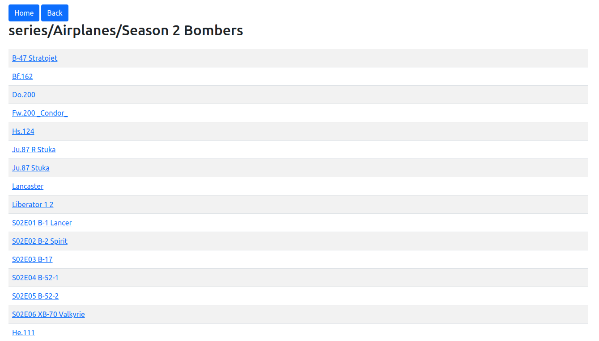

# stsmedserv
Stupidly simple media server

# What is it?
I'm a big fan of KODI, but sometimes, for some reason it's not working. May be the problem is with samba implementation on my Raspberrypi4 which acts as NAS, who knows. So I desided to create this simple media server as a "backup" for KODI. 

# How it works?
It's a web server which I'm running on NAS(raspberrypi4). It's exposing my video files via HTTP. So, using web browser like Google Chrome I can watch videos from my NAS.

# Is it taking some "meta" information about video from internet?
No, it's 100% "offline". The only option now is a picture for folder. If folder has a file: 
```
poster.jpg
```
it will be displayed. 

# Some technical details
It's a python application which use FLASK as web server. It's not recoding/decoding/encoding video, it's just exposing video to your browser and browser acts as "video player". If your video in some old format like divx/xvid - browser will not be able to play it. Modern formats like h.264 are working fine(at least in Google Chrome).   

# Some screenshots
Folders with videos(like "Season1", "Season2"...):


And when we're clicking on some folder, we're drillind down to "file list view":  videos inside folder(like S01E01.avi, S01E02.avi...):


And next, when we're clicking on some video, we're finally reaching "play window" in which video is starts playing. It also has Prev/Next buttons. At the end of video - it jumps automatically to next. 


# How to run it? 
- Download as zip or "git clone" this repo
- Install python3 if you don't have it
- Install pip for python if you don't have it
- If you don't want to pollute your python installation - create virtual environment: 
```
python3 -m venv .env
```
and activate it:
```
source .venv/bin/activate
```
- Install dependensies (actually it's just a flask):
```
pip install -r requirements.txt
```
- Configuration:
There are parameters in file stsmedserv.ini:
    - base_path - mandatory parameter. It's a path to your video library.  
    - root_folder_filter - optional parameter. In my case I have 2 different folders with videos: one for series and one for movies. The only way to show them is to configure "parent" for them as "base_path". But in this "parent" I have also many other folders which I don't want to show. This parameter is to provide just list of folders which should be shown (in my case it's 2 folders: movies and series). Folders should be separeted by coma (",").
```
[main]
base_path = /home/dmitry
# root_folder_filter = series,movies
```    
- Run server:
```
sh ./run.sh 
```
- Open your web browser:
```
http://hostname or ip addr:5000/
```